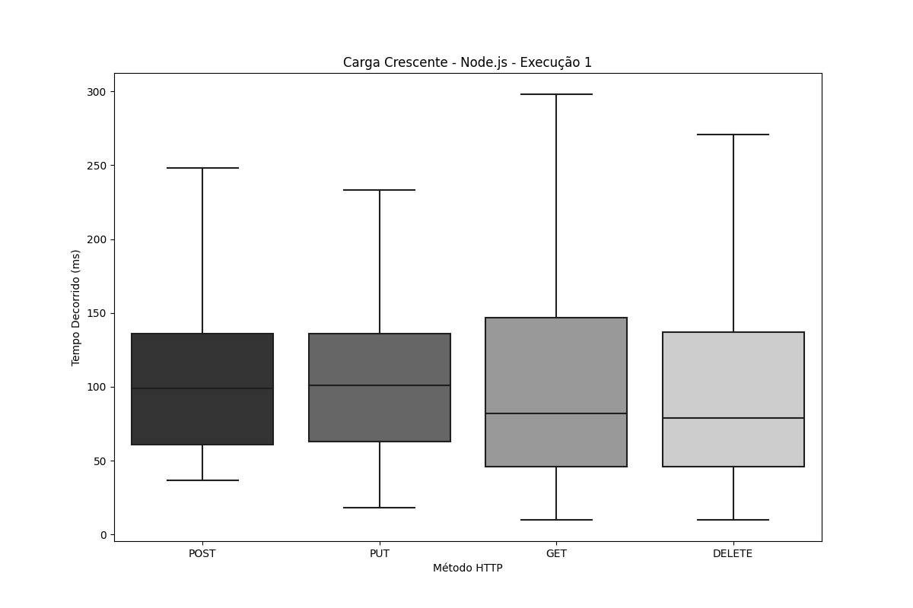
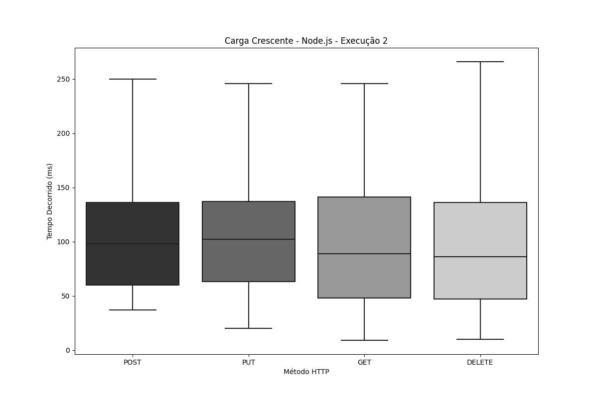
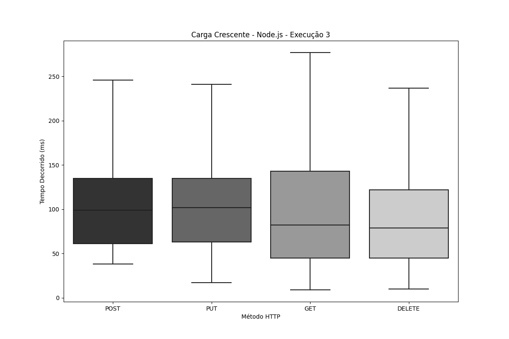
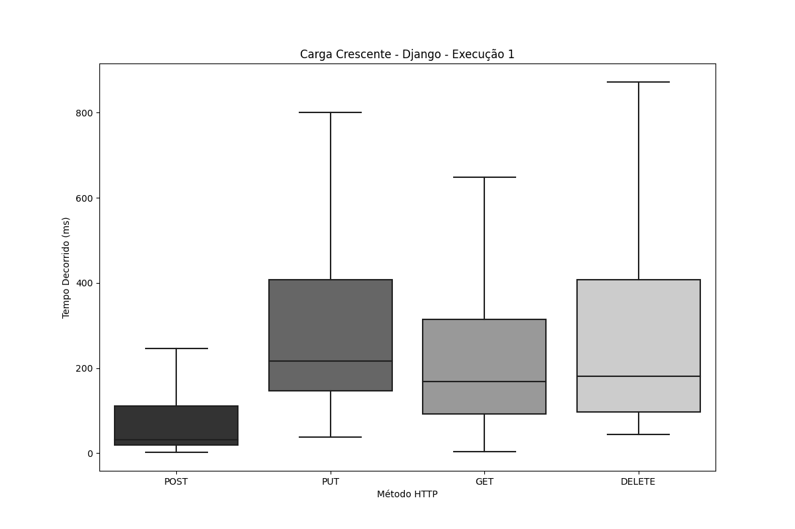
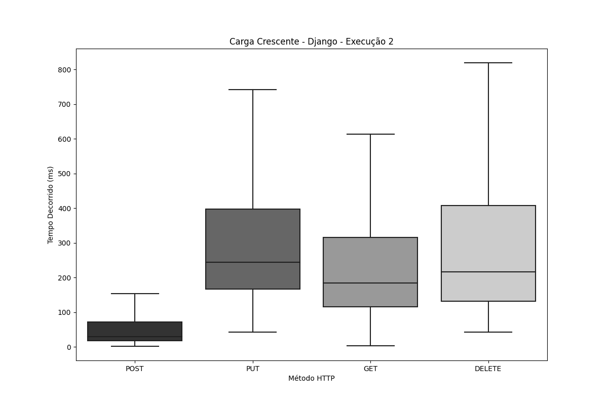
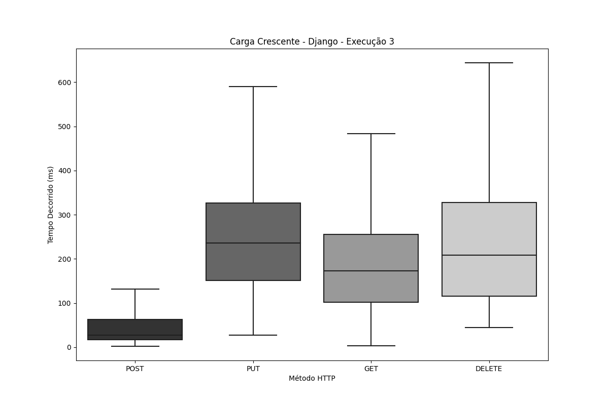
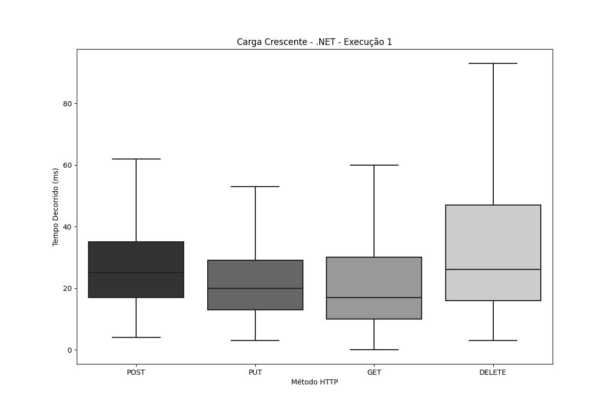
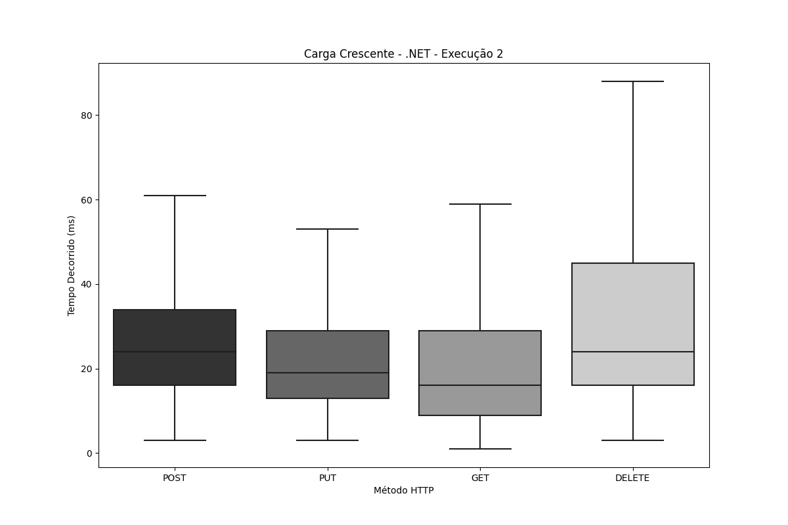
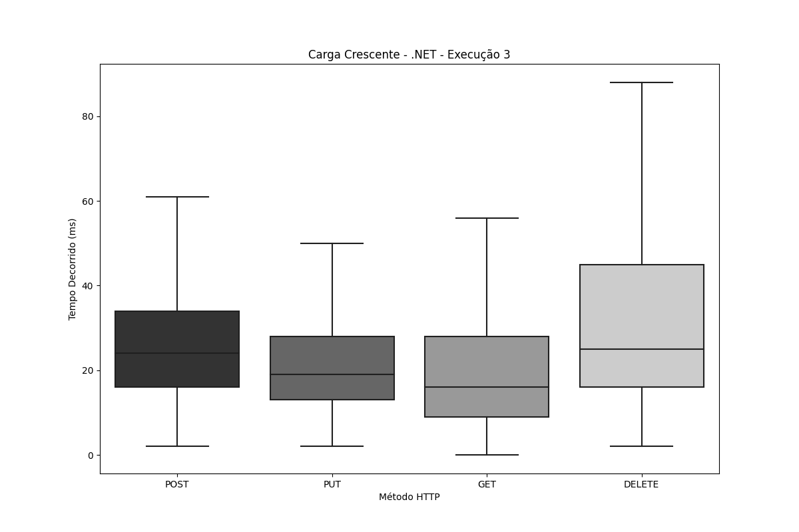

# Teste de Carga Crescente

1. [Node.js](#nodejs)
2. [Django](#django)
3. [.NET](#net)

---
# Node.js
## Node.js - Execução 1

| Tipo   | Amostras | Falhas | Erro % | Average | Min | Max   | Median | 90th pct | 95th pct | 99th pct | Transaction/s | Received | Send  |
|--------|----------|--------|--------|---------|-----|-------|--------|-----------|-----------|-----------|----------------|----------|-------|
| **Total**  | 179.499,0 | 0 | 0,00% | 97,8 | 10,0 | 625,0 | 169,0 | 221,0 | 233,0 | 254,0 | 1.281,0 | 14.129,2 | 320,1 |
| **DELETE** | 44.475,0 | 0 | 0,00% | 91,9 | 10,0 | 350,0 | 142,0 | 202,0 | 216,0 | 252,0 | 318,9 | 54,8 | 69,4 |
| **GET**    | 44.809,0 | 0 | 0,00% | 98,4 | 10,0 | 621,0 | 151,0 | 218,0 | 233,0 | 374,0 | 320,0 | 13.884,0 | 40,9 |
| **POST**   | 45.260,0 | 0 | 0,00% | 99,4 | 37,0 | 341,0 | 137,0 | 160,0 | 163,0 | 263,0 | 323,8 | 115,7 | 100,3 |
| **PUT**    | 44.955,0 | 0 | 0,00% | 101,5 | 18,0 | 625,0 | 139,0 | 167,0 | 169,0 | 175,0 | 321,4 | 85,1 | 110,3 |

## Node.js - Execução 2

| Tipo   | Amostras | Falhas | Erro % | Average | Min | Max   | Median | 90th pct | 95th pct | 99th pct | Transaction/s | Received | Send  |
|--------|----------|--------|--------|---------|-----|-------|--------|-----------|-----------|-----------|----------------|----------|-------|
| **Total**  | 181.066,0 | 0 | 0,00% | 96,9 | 9,0 | 376,0 | 164,0 | 179,0 | 193,0 | 292,4 | 1.292,6 | 14.169,6 | 323,0 |
| **DELETE** | 44.980,0 | 0 | 0,00% | 90,5 | 10,0 | 282,0 | 138,0 | 167,0 | 172,0 | 191,0 | 322,5 | 55,4 | 70,2 |
| **GET**    | 45.144,0 | 0 | 0,00% | 95,1 | 9,0 | 375,0 | 148,0 | 179,0 | 191,0 | 203,0 | 322,5 | 13.923,6 | 41,3 |
| **POST**   | 45.545,0 | 0 | 0,00% | 99,9 | 37,0 | 362,0 | 138,0 | 159,0 | 163,0 | 279,0 | 325,8 | 116,4 | 100,9 |
| **PUT**    | 45.397,0 | 0 | 0,00% | 102,3 | 20,0 | 376,0 | 140,0 | 166,0 | 170,0 | 299,0 | 324,6 | 85,9 | 111,4 |

## Node.js - Execução 3

| Tipo   | Amostras | Falhas | Erro % | Average | Min | Max   | Median | 90th pct | 95th pct | 99th pct | Transaction/s | Received | Send  |
|--------|----------|--------|--------|---------|-----|-------|--------|-----------|-----------|-----------|----------------|----------|-------|
| **Total**  | 181.596,0 | 0 | 0,00% | 96,7 | 9,0 | 331,0 | 171,0 | 219,0 | 232,0 | 253,0 | 1.295,7 | 13.574,1 | 323,7 |
| **DELETE** | 45.029,0 | 0 | 0,00% | 91,0 | 10,0 | 312,0 | 141,0 | 201,0 | 214,0 | 263,0 | 323,0 | 55,5 | 70,3 |
| **GET**    | 45.320,0 | 0 | 0,00% | 95,6 | 9,0 | 277,0 | 146,0 | 217,0 | 231,0 | 254,0 | 323,6 | 13.326,1 | 41,4 |
| **POST**   | 45.794,0 | 0 | 0,00% | 98,9 | 38,0 | 325,0 | 136,0 | 160,0 | 165,0 | 284,0 | 327,7 | 117,1 | 101,5 |
| **PUT**    | 45.453,0 | 0 | 0,00% | 101,2 | 17,0 | 331,0 | 139,0 | 169,0 | 172,0 | 241,0 | 325,0 | 86,0 | 111,6 |

<h1 align="center">
  
  
  
</h1>

## Node.js - Média das execuções

| Tipo   | Amostras | Falhas | Erro % | Average | Min  | Max   | Median | 90th pct | 95th pct | 99th pct | Transaction/s | Received | Send  |
|--------|----------|--------|--------|---------|------|-------|--------|-----------|-----------|-----------|----------------|----------|-------|
| **Total**  | 180.720,3 | 0,00 | 0,00% | 97,1 | 9,3  | 444,0 | 168,0 | 206,3 | 219,3 | 266,5 | 1.289,8 | 13.957,6 | 322,3 |
| **DELETE** | 44.828,0 | 0,00 | 0,00% | 91,1 | 10,0 | 314,7 | 140,3 | 190,0 | 200,7 | 235,3 | 321,4 | 55,2 | 69,9 |
| **GET**    | 45.091,0 | 0,00 | 0,00% | 96,3 | 9,3  | 424,3 | 148,3 | 204,7 | 218,3 | 277,0 | 322,0 | 13.711,2 | 41,2 |
| **POST**   | 45.533,0 | 0,00 | 0,00% | 99,4 | 37,3 | 342,7 | 137,0 | 159,7 | 163,7 | 275,3 | 325,8 | 116,4 | 100,9 |
| **PUT**    | 45.268,3 | 0,00 | 0,00% | 101,7 | 18,3 | 444,0 | 139,3 | 167,3 | 170,3 | 238,3 | 323,7 | 85,7 | 111,1 |

---

# Django 
## Django - Execução 1 

| Tipo   | Amostras | Falhas | Erro % | Average | Min | Max   | Median | 90th pct | 95th pct | 99th pct | Transaction/s | Received | Send  |
|--------|----------|--------|--------|---------|-----|-------|--------|-----------|-----------|-----------|----------------|----------|-------|
| **Total**  | 65.056,0 | 22 | 0,03% | 312,3 | 2,0 | 110.631,0 | 419,0 | 671,0 | 812,0 | 3.130,9 | 282,2 | 2.331,3 | 70,6 |
| **DELETE** | 15.953,0 | 0 | 0,00% | 265,3 | 44,0 | 1.405,0 | 180,0 | 544,0 | 639,0 | 839,9 | 113,8 | 34,0 | 24,7 |
| **GET**    | 16.125,0 | 0 | 0,00% | 215,1 | 3,0 | 1.157,0 | 168,0 | 417,0 | 498,0 | 653,7 | 115,1 | 3.694,1 | 14,7 |
| **POST**   | 16.575,0 | 22 | 0,13% | 477,2 | 2,0 | 110.631,0 | 31,0 | 491,0 | 1.087,0 | 4.483,7 | 71,9 | 32,1 | 22,2 |
| **PUT**    | 16.403,0 | 0 | 0,00% | 286,7 | 38,0 | 1.497,0 | 216,0 | 545,0 | 635,0 | 835,0 | 117,0 | 53,8 | 40,1 |

## Django - Execução 2

| Tipo   | Amostras | Falhas | Erro % | Average | Min | Max   | Median | 90th pct | 95th pct | 99th pct | Transaction/s | Received | Send  |
|--------|----------|--------|--------|---------|-----|-------|--------|-----------|-----------|-----------|----------------|----------|-------|
| **Total**  | 64.564,0 | 50 | 0,08% | 355,6 | 2,0 | 108.310,0 | 417,0 | 629,0 | 700,0 | 4.371,9 | 282,9 | 2.331,7 | 70,7 |
| **DELETE** | 15.825,0 | 0 | 0,00% | 269,3 | 43,0 | 879,0 | 216,0 | 533,4 | 596,0 | 701,0 | 112,9 | 33,7 | 24,5 |
| **GET**    | 16.004,0 | 0 | 0,00% | 225,3 | 3,0 | 940,0 | 184,0 | 451,0 | 517,0 | 629,0 | 114,2 | 3.656,2 | 14,6 |
| **POST**   | 16.441,0 | 50 | 0,30% | 633,1 | 2,0 | 108.310,0 | 29,0 | 209,0 | 1.049,0 | 7.827,9 | 72,0 | 32,4 | 22,2 |
| **PUT**    | 16.294,0 | 0 | 0,00% | 287,4 | 43,0 | 872,0 | 244,0 | 540,0 | 619,0 | 723,0 | 116,1 | 53,4 | 39,8 |

## Django - Execução 3

| Tipo   | Amostras | Falhas | Erro % | Average | Min | Max   | Median | 90th pct | 95th pct | 99th pct | Transaction/s | Received | Send  |
|--------|----------|--------|--------|---------|-----|-------|--------|-----------|-----------|-----------|----------------|----------|-------|
| **Total**  | 65.578,0 | 17 | 0,03% | 326,1 | 2,0 | 111.278,0 | 319,0 | 1.003,0 | 1.097,0 | 3.768,9 | 316,0 | 2.544,4 | 79,0 |
| **DELETE** | 16.073,0 | 0 | 0,00% | 264,4 | 44,0 | 1.233,0 | 208,0 | 459,0 | 882,0 | 1.107,0 | 114,4 | 34,2 | 24,8 |
| **GET**    | 16.289,0 | 0 | 0,00% | 223,2 | 3,0 | 1.165,0 | 173,0 | 344,0 | 812,0 | 1.034,0 | 115,9 | 3.615,9 | 14,8 |
| **POST**   | 16.702,0 | 17 | 0,10% | 526,4 | 2,0 | 111.278,0 | 27,0 | 267,0 | 1.051,0 | 5.959,8 | 80,5 | 35,9 | 24,9 |
| **PUT**    | 16.514,0 | 0 | 0,00% | 285,0 | 27,0 | 1.247,0 | 236,0 | 442,0 | 891,3 | 1.128,0 | 117,4 | 54,1 | 40,2 |

<h1 align="center">
  
  
  
</h1>

## Django - Média das execuções

| Tipo   | Amostras | Falhas | Erro % | Average | Min | Max   | Median | 90th pct | 95th pct | 99th pct | Transaction/s | Received | Send  |
|--------|----------|--------|--------|---------|-----|-------|--------|-----------|-----------|-----------|----------------|----------|-------|
| **Total**  | 65.066,0 | 29,67 | 0,05% | 331,3 | 2,0 | 110.073,0 | 385,0 | 767,7 | 869,7 | 3.757,2 | 293,7 | 2.402,5 | 73,4 |
| **DELETE** | 15.950,3 | 0,00 | 0,00% | 266,3 | 43,7 | 1.172,3 | 201,3 | 512,1 | 705,7 | 882,6 | 113,7 | 34,0 | 24,7 |
| **GET**    | 16.139,3 | 0,00 | 0,00% | 221,2 | 3,0 | 1.087,3 | 175,0 | 404,0 | 609,0 | 772,2 | 115,0 | 3.655,4 | 14,7 |
| **POST**   | 16.572,7 | 29,67 | 0,18% | 545,6 | 2,0 | 110.073,0 | 29,0 | 322,3 | 1.062,3 | 6.090,5 | 74,8 | 33,4 | 23,1 |
| **PUT**    | 16.403,7 | 0,00 | 0,00% | 286,4 | 36,0 | 1.205,3 | 232,0 | 509,0 | 715,1 | 895,3 | 116,8 | 53,8 | 40,0 |

---

# .NET 
## .NET - Execução 1

| Tipo   | Amostras | Falhas | Erro % | Average | Min | Max   | Median | 90th pct | 95th pct | 99th pct | Transaction/s | Received | Send  |
|--------|----------|--------|--------|---------|-----|-------|--------|-----------|-----------|-----------|----------------|----------|-------|
| **Total**  | 639.934,0 | 0 | 0,00% | 27,2 | 0,0 | 2.444,0 | 48,0 | 75,0 | 85,0 | 122,0 | 4.572,2 | 43.511,7 | 1.156,7 |
| **DELETE** | 159.706,0 | 0 | 0,00% | 34,7 | 3,0 | 603,0 | 67,0 | 93,0 | 103,0 | 161,0 | 1.150,7 | 91,0 | 254,3 |
| **GET**    | 159.865,0 | 0 | 0,00% | 21,7 | 0,0 | 234,0 | 44,0 | 64,0 | 71,0 | 87,0 | 1.150,9 | 43.273,4 | 150,6 |
| **POST**   | 160.325,0 | 0 | 0,00% | 28,8 | 4,0 | 2.444,0 | 44,0 | 64,0 | 71,0 | 98,0 | 1.145,5 | 384,4 | 358,0 |
| **PUT**    | 160.038,0 | 0 | 0,00% | 23,6 | 3,0 | 424,0 | 39,0 | 57,0 | 63,0 | 89,0 | 1.151,9 | 91,1 | 400,0 |

## .NET - Execução 2

| Tipo   | Amostras | Falhas | Erro % | Average | Min | Max   | Median | 90th pct | 95th pct | 99th pct | Transaction/s | Received | Send  |
|--------|----------|--------|--------|---------|-----|-------|--------|-----------|-----------|-----------|----------------|----------|-------|
| **Total**  | 655.535,0 | 0 | 0,00% | 26,6 | 1,0 | 2.071,0 | 46,0 | 73,0 | 82,0 | 126,0 | 4.683,5 | 42.388,3 | 1.184,9 |
| **DELETE** | 163.584,0 | 0 | 0,00% | 33,9 | 3,0 | 1.725,0 | 66,0 | 87,0 | 96,0 | 178,0 | 1.178,8 | 93,2 | 260,5 |
| **GET**    | 163.775,0 | 0 | 0,00% | 21,0 | 1,0 | 1.697,0 | 43,0 | 60,0 | 66,0 | 82,0 | 1.179,1 | 42.131,9 | 154,3 |
| **POST**   | 164.195,0 | 0 | 0,00% | 28,2 | 3,0 | 2.071,0 | 44,0 | 61,0 | 67,0 | 97,0 | 1.173,2 | 393,7 | 366,6 |
| **PUT**    | 163.981,0 | 0 | 0,00% | 23,2 | 3,0 | 1.709,0 | 39,0 | 54,0 | 60,0 | 80,0 | 1.180,4 | 93,4 | 410,0 |

## .NET - Execução 3

| Tipo   | Amostras | Falhas | Erro % | Average | Min | Max   | Median | 90th pct | 95th pct | 99th pct | Transaction/s | Received | Send  |
|--------|----------|--------|--------|---------|-----|-------|--------|-----------|-----------|-----------|----------------|----------|-------|
| **Total**  | 657.288,0 | 0 | 0,00% | 26,5 | 0,0 | 1.900,0 | 45,0 | 71,0 | 80,0 | 126,0 | 4.696,8 | 41.850,0 | 1.188,2 |
| **DELETE** | 164.047,0 | 0 | 0,00% | 33,9 | 2,0 | 1.072,0 | 63,0 | 88,0 | 98,0 | 173,0 | 1.182,0 | 93,5 | 261,2 |
| **GET**    | 164.237,0 | 0 | 0,00% | 21,0 | 0,0 | 1.046,0 | 42,0 | 64,0 | 72,0 | 92,0 | 1.182,4 | 41.578,3 | 154,7 |
| **POST**   | 164.605,0 | 0 | 0,00% | 28,0 | 2,0 | 1.900,0 | 42,0 | 60,0 | 68,0 | 126,0 | 1.176,3 | 394,7 | 367,6 |
| **PUT**    | 164.399,0 | 0 | 0,00% | 23,0 | 2,0 | 1.055,0 | 36,0 | 54,0 | 61,0 | 109,0 | 1.183,3 | 93,6 | 411,0 |

<h1 align="center">
  
  
  
</h1>

## .NET - Média das execuções

| Tipo   | Amostras | Falhas | Erro % | Average | Min | Max   | Median | 90th pct | 95th pct | 99th pct | Transaction/s | Received | Send  |
|--------|----------|--------|--------|---------|-----|-------|--------|-----------|-----------|-----------|----------------|----------|-------|
| **Total**  | 650.919,0 | 0,00 | 0,00% | 26,7 | 0,3 | 2.138,3 | 46,3 | 73,0 | 82,3 | 124,7 | 4.650,8 | 42.583,3 | 1.176,6 |
| **DELETE** | 162.445,7 | 0,00 | 0,00% | 34,2 | 2,7 | 1.133,3 | 65,3 | 89,3 | 99,0 | 170,7 | 1.170,5 | 92,6 | 258,7 |
| **GET**    | 162.625,7 | 0,00 | 0,00% | 21,2 | 0,3 | 992,3 | 43,0 | 62,7 | 69,7 | 87,0 | 1.170,8 | 42.327,9 | 153,2 |
| **POST**   | 163.041,7 | 0,00 | 0,00% | 28,3 | 3,0 | 2.138,3 | 43,3 | 61,7 | 68,7 | 107,0 | 1.165,0 | 390,9 | 364,1 |
| **PUT**    | 162.806,0 | 0,00 | 0,00% | 23,3 | 2,7 | 1.062,7 | 38,0 | 55,0 | 61,3 | 92,7 | 1.171,9 | 92,7 | 407,0 |
