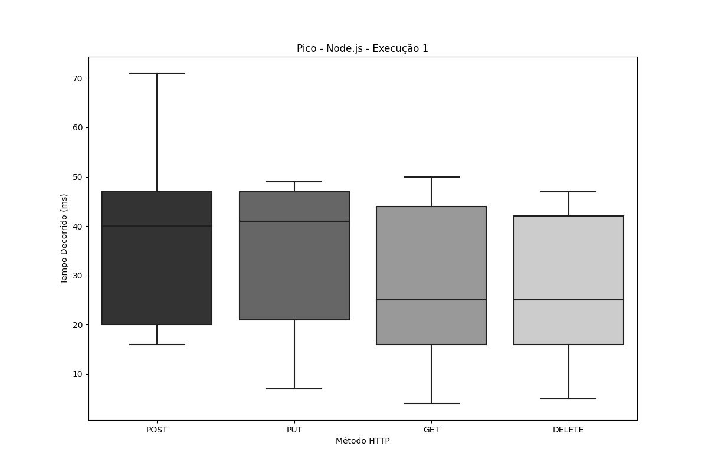
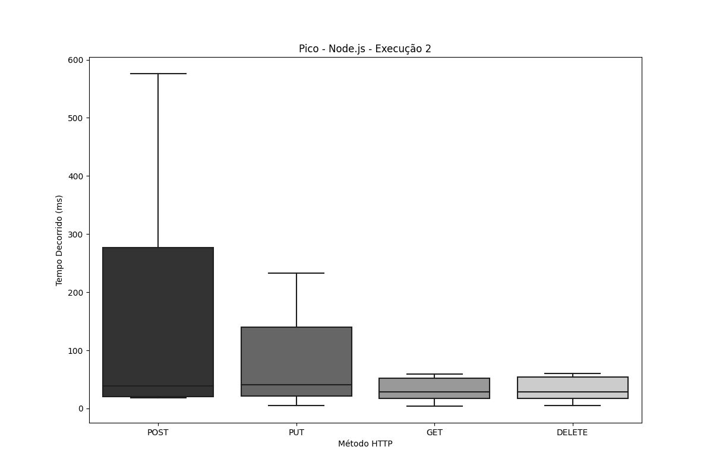
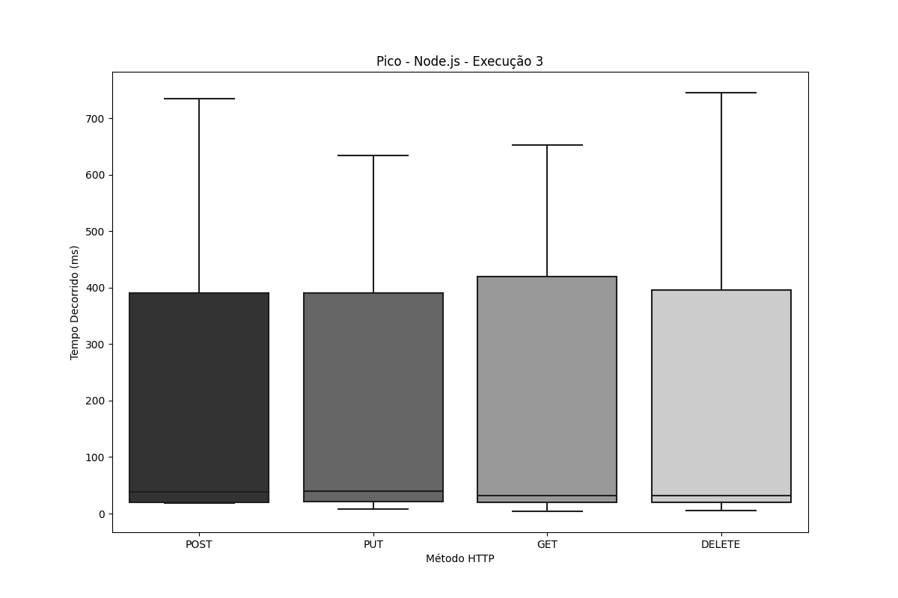
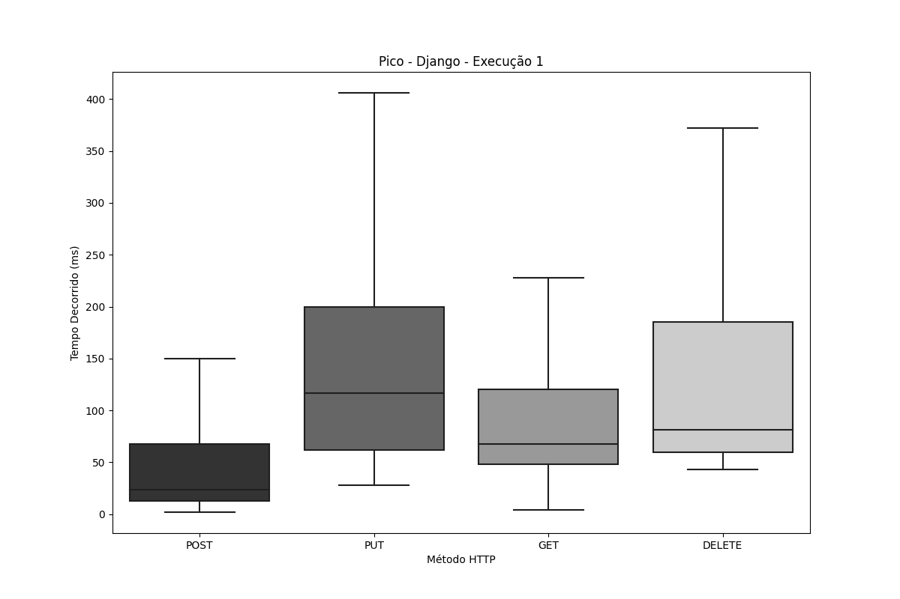
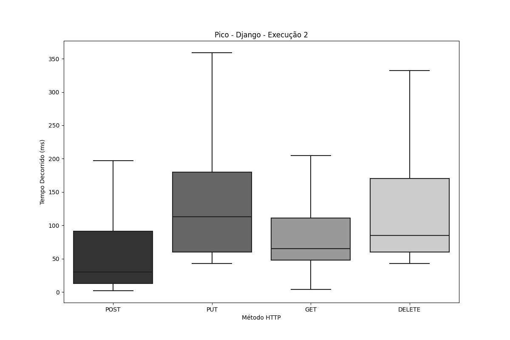
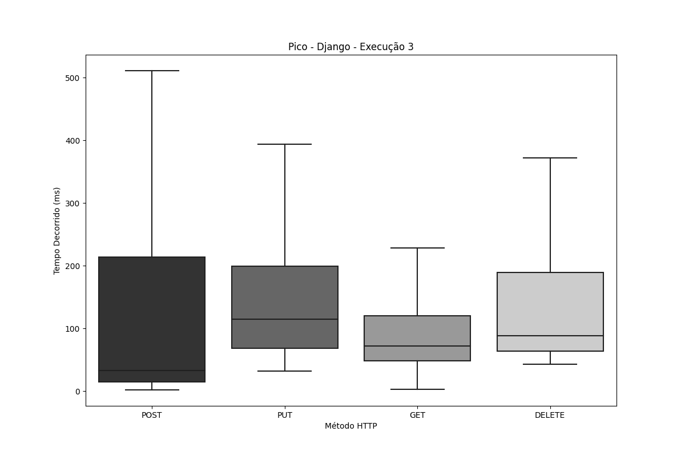
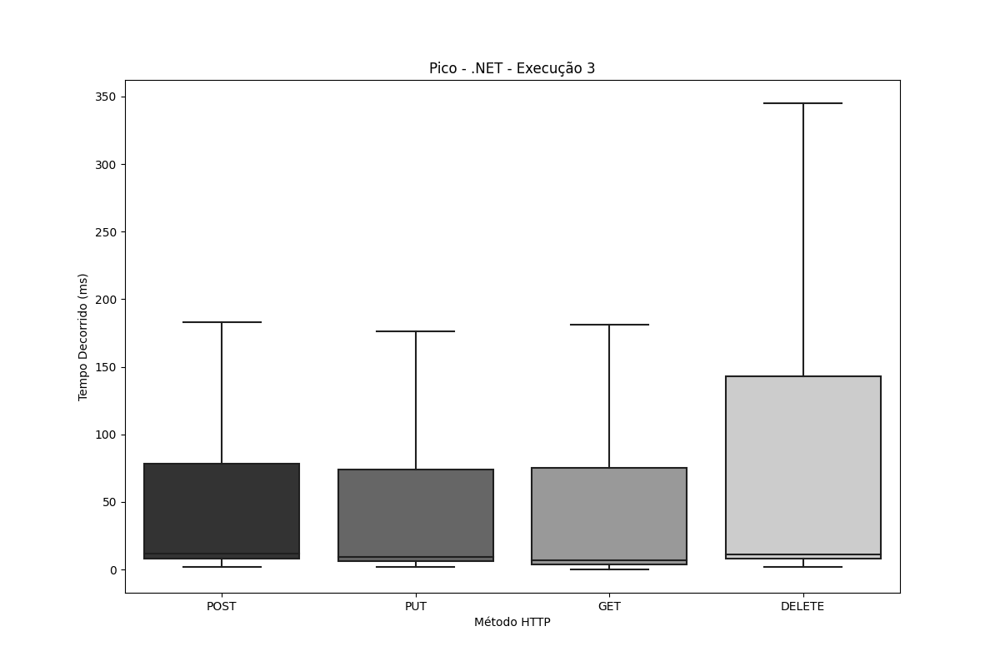

# Teste de Pico

1. [Node.js](#nodejs)
2. [Django](#django)
3. [.NET](#net)

---
# Node.js
## Node.js - Execução 1

| Tipo   | Amostras | Falhas | Erro % | Average | Min | Max | Median | 90th pct | 95th pct | 99th pct | Transaction/s | Received | Send  |
|--------|----------|--------|--------|---------|-----|-----|--------|----------|----------|-----------|----------------|----------|-------|
| **Total**  | 148.400,0 | 0 | 0,00% | 121,9 | 4,0 | 557,0 | 19,0 | 21,0 | 22,0 | 24,0 | 1.349,8 | 9.695,1 | 336,9 |
| **DELETE** | 37.010,0 | 0 | 0,00% | 118,7 | 5,0 | 525,0 | 29,0 | 422,0 | 441,0 | 461,0 | 337,1 | 57,9 | 73,3 |
| **GET**    | 37.092,0 | 0 | 0,00% | 123,5 | 4,0 | 534,0 | 29,0 | 439,0 | 449,0 | 521,0 | 337,8 | 9.439,6 | 43,2 |
| **POST**   | 37.160,0 | 0 | 0,00% | 121,1 | 16,0 | 557,0 | 40,0 | 404,0 | 412,0 | 418,0 | 338,1 | 120,7 | 104,7 |
| **PUT**    | 37.138,0 | 0 | 0,00% | 124,3 | 7,0 | 494,0 | 41,0 | 419,0 | 424,0 | 467,0 | 338,0 | 89,5 | 116,0 |

## Node.js - Execução 2

| Tipo   | Amostras | Falhas | Erro % | Average | Min | Max | Median | 90th pct | 95th pct | 99th pct | Transaction/s | Received | Send  |
|--------|----------|--------|--------|---------|-----|-----|--------|----------|----------|-----------|----------------|----------|-------|
| **Total**  | 145.269,0 | 0 | 0,00% | 124,5 | 4,0 | 606,0 | 19,0 | 21,0 | 21,0 | 24,0 | 1.321,3 | 12.006,0 | 329,9 |
| **DELETE** | 36.225,0 | 0 | 0,00% | 123,0 | 5,0 | 606,0 | 37,0 | 413,0 | 426,0 | 581,0 | 330,0 | 56,7 | 71,8 |
| **GET**    | 36.239,0 | 0 | 0,00% | 124,2 | 4,0 | 479,0 | 38,0 | 435,0 | 440,0 | 452,0 | 329,9 | 11.752,3 | 42,2 |
| **POST**   | 36.555,0 | 0 | 0,00% | 125,1 | 18,0 | 576,0 | 40,0 | 403,0 | 406,0 | 412,0 | 332,6 | 118,8 | 103,0 |
| **PUT**    | 36.250,0 | 0 | 0,00% | 125,8 | 5,0 | 459,0 | 41,0 | 419,0 | 428,0 | 444,0 | 330,0 | 87,3 | 113,2 |

## Node.js - Execução 3

| Tipo   | Amostras | Falhas | Erro % | Average | Min | Max | Median | 90th pct | 95th pct | 99th pct | Transaction/s | Received | Send  |
|--------|----------|--------|--------|---------|-----|-----|--------|----------|----------|-----------|----------------|----------|-------|
| **Total**  | 137.388,0 | 0 | 0,00% | 132,1 | 4,0 | 745,0 | 21,0 | 26,0 | 29,0 | 34,0 | 1.249,7 | 16.399,5 | 312,4 |
| **DELETE** | 33.975,0 | 0 | 0,00% | 129,4 | 5,0 | 745,0 | 48,0 | 437,0 | 450,0 | 683,0 | 309,4 | 53,2 | 67,3 |
| **GET**    | 34.240,0 | 0 | 0,00% | 135,9 | 4,0 | 653,0 | 49,0 | 456,0 | 466,0 | 637,0 | 311,8 | 16.171,4 | 39,9 |
| **POST**   | 34.617,0 | 0 | 0,00% | 130,9 | 18,0 | 735,0 | 40,0 | 408,0 | 420,0 | 590,0 | 314,9 | 112,5 | 97,5 |
| **PUT**    | 34.556,0 | 0 | 0,00% | 132,2 | 8,0 | 634,0 | 41,0 | 421,0 | 427,0 | 630,0 | 314,5 | 83,2 | 107,9 |

<h1 align="center">
  
  
  
</h1>

## Node.js - Média das execuções

| Tipo   | Amostras | Falhas | Erro % | Average | Min | Max | Median | 90th pct | 95th pct | 99th pct | Transaction/s | Received | Send  |
|--------|----------|--------|--------|---------|-----|-----|--------|----------|----------|-----------|----------------|----------|-------|
| **Total**  | 143.685,7 | 0,00 | 0,00 | 126,2 | 4,0 | 636,0 | 19,7 | 22,7 | 24,0 | 27,3 | 1.306,9 | 12.700,2 | 326,4 |
| **DELETE** | 35.736,7 | 0,00 | 0,00 | 123,7 | 5,0 | 625,3 | 38,0 | 424,0 | 439,0 | 575,0 | 325,5 | 55,9 | 70,8 |
| **GET**    | 35.857,0 | 0,00 | 0,00 | 127,8 | 4,0 | 555,3 | 38,7 | 443,3 | 451,7 | 536,7 | 326,5 | 12.454,4 | 41,8 |
| **POST**   | 36.110,7 | 0,00 | 0,00 | 125,7 | 17,3 | 622,7 | 40,0 | 405,0 | 412,7 | 473,3 | 328,5 | 117,3 | 101,7 |
| **PUT**    | 35.981,3 | 0,00 | 0,00 | 127,4 | 6,7 | 529,0 | 41,0 | 419,7 | 426,3 | 513,7 | 327,5 | 86,7 | 112,4 |

---

# Django 
## Django - Execução 1 

| Tipo   | Amostras | Falhas | Erro % | Average | Min | Max | Median | 90th pct | 95th pct | 99th pct | Transaction/s | Received | Send  |
|--------|----------|--------|--------|---------|-----|-----|--------|----------|----------|-----------|----------------|----------|-------|
| **Total**  | 52.691,0 | 84 | 0,16% | 490,8 | 2,0 | 114.212,0 | 96,0 | 938,0 | 1.156,0 | 1.788,9 | 341,8 | 2.456,9 | 85,3 |
| **DELETE** | 12.947,0 | 0 | 0,00% | 275,2 | 43,0 | 2.560,0 | 81,0 | 982,0 | 1.207,0 | 1.528,6 | 117,9 | 35,2 | 25,6 |
| **GET**    | 13.049,0 | 0 | 0,00% | 214,9 | 4,0 | 2.221,0 | 68,0 | 777,0 | 993,0 | 1.278,0 | 118,8 | 3.301,9 | 15,2 |
| **POST**   | 13.457,0 | 84 | 0,62% | 1.163,4 | 2,0 | 114.212,0 | 24,0 | 840,0 | 1.139,0 | 29.362,8 | 87,3 | 39,8 | 26,9 |
| **PUT**    | 13.238,0 | 0 | 0,00% | 289,8 | 28,0 | 2.596,0 | 117,0 | 972,0 | 1.211,0 | 1.611,0 | 120,4 | 55,4 | 41,2 |

## Django - Execução 2

| Tipo   | Amostras | Falhas | Erro % | Average | Min | Max | Median | 90th pct | 95th pct | 99th pct | Transaction/s | Received | Send  |
|--------|----------|--------|--------|---------|-----|-----|--------|----------|----------|-----------|----------------|----------|-------|
| **Total**  | 53.616,0 | 108 | 0,20% | 506,4 | 2,0 | 110.570,0 | 89,0 | 967,0 | 1.209,0 | 1.868,9 | 356,2 | 2.511,8 | 88,8 |
| **DELETE** | 13.179,0 | 0 | 0,00% | 263,5 | 43,0 | 2.259,0 | 85,0 | 913,0 | 1.159,0 | 1.570,4 | 120,0 | 35,9 | 26,0 |
| **GET**    | 13.284,0 | 0 | 0,00% | 189,4 | 4,0 | 2.092,0 | 65,0 | 660,0 | 843,0 | 1.225,2 | 120,9 | 3.292,3 | 15,5 |
| **POST**   | 13.693,0 | 108 | 0,79% | 1.276,6 | 2,0 | 110.570,0 | 30,0 | 891,6 | 1.227,0 | 16.617,0 | 91,0 | 41,8 | 27,9 |
| **PUT**    | 13.460,0 | 0 | 0,00% | 273,7 | 43,0 | 2.717,0 | 113,0 | 917,0 | 1.147,0 | 1.586,0 | 122,4 | 56,3 | 41,9 |

## Django - Execução 3

| Tipo   | Amostras | Falhas | Erro % | Average | Min | Max | Median | 90th pct | 95th pct | 99th pct | Transaction/s | Received | Send  |
|--------|----------|--------|--------|---------|-----|-----|--------|----------|----------|-----------|----------------|----------|-------|
| **Total**  | 53.004,0 | 142 | 0,27% | 566,4 | 2,0 | 111.156,0 | 88,0 | 810,0 | 1.047,0 | 1.607,0 | 350,8 | 2.413,5 | 87,4 |
| **DELETE** | 13.034,0 | 0 | 0,00% | 268,9 | 43,0 | 2.375,0 | 88,0 | 908,0 | 1.096,0 | 1.432,0 | 118,7 | 35,5 | 25,8 |
| **GET**    | 13.133,0 | 0 | 0,00% | 194,6 | 3,0 | 1.964,0 | 72,0 | 654,0 | 826,0 | 1.152,7 | 119,6 | 3.173,3 | 15,3 |
| **POST**   | 13.540,0 | 142 | 1,05% | 1.493,9 | 2,0 | 111.156,0 | 33,0 | 841,0 | 1.119,0 | 111.082,0 | 89,6 | 41,6 | 27,5 |
| **PUT**    | 13.297,0 | 0 | 0,00% | 280,8 | 32,0 | 2.255,0 | 115,0 | 911,0 | 1.101,0 | 1.439,0 | 121,0 | 55,7 | 41,4 |

<h1 align="center">
  
  
  
</h1>

## Django - Média das execuções

| Tipo   | Amostras | Falhas | Erro % | Average | Min  | Max   | Median | 90th pct | 95th pct | 99th pct | Transaction/s | Received | Send  |
|--------|----------|--------|--------|---------|------|-------|--------|-----------|-----------|-----------|----------------|----------|-------|
| **Total**  | 53.103,7 | 111,33 | 0,21% | 521,2 | 2,0  | 111.979,3 | 91,0 | 905,0 | 1.137,3 | 1.754,9 | 349,6 | 2.460,8 | 87,2 |
| **DELETE** | 13.053,3 | 0,00 | 0,00% | 269,2 | 43,0 | 2.398,0 | 84,7 | 934,3 | 1.154,0 | 1.510,3 | 118,9 | 35,5 | 25,8 |
| **GET**    | 13.155,3 | 0,00 | 0,00% | 199,6 | 3,7  | 2.092,3 | 68,3 | 697,0 | 887,3 | 1.218,6 | 119,8 | 3.255,8 | 15,3 |
| **POST**   | 13.563,3 | 111,33 | 0,82% | 1.311,3 | 2,0  | 111.979,3 | 29,0 | 857,5 | 1.161,7 | 52.353,9 | 89,3 | 41,0 | 27,4 |
| **PUT**    | 13.331,7 | 0,00 | 0,00% | 281,4 | 34,3 | 2.522,7 | 115,0 | 933,3 | 1.153,0 | 1.545,3 | 121,3 | 55,8 | 41,5 |

---

# .NET 
## .NET - Execução 1

| Tipo   | Amostras | Falhas | Erro % | Average | Min  | Max   | Median | 90th pct | 95th pct | 99th pct | Transaction/s | Received | Send   |
|--------|----------|--------|--------|---------|------|-------|--------|-----------|-----------|-----------|----------------|----------|--------|
| **Total**  | 450.789,0 | 0 | 0,00% | 39,8 | 0,0 | 2.288,0 | 6,0 | 10,0 | 12,0 | 19,0 | 4.100,6 | 40.541,7 | 1.036,6 |
| **DELETE** | 112.489,0 | 0 | 0,00% | 57,7 | 2,0 | 370,0 | 8,0 | 13,0 | 16,0 | 25,0 | 1.034,2 | 81,8 | 228,3 |
| **GET**    | 112.611,0 | 0 | 0,00% | 32,7 | 0,0 | 284,0 | 5,0 | 9,0 | 11,0 | 16,0 | 1.034,2 | 40.419,4 | 135,3 |
| **POST**   | 112.931,0 | 0 | 0,00% | 35,8 | 2,0 | 2.288,0 | 8,0 | 14,0 | 16,0 | 24,0 | 1.027,3 | 344,1 | 321,0 |
| **PUT**    | 112.758,0 | 0 | 0,00% | 32,9 | 2,0 | 350,0 | 6,0 | 11,0 | 13,0 | 19,0 | 1.035,4 | 81,9 | 359,0 |

## .NET - Execução 2

| Tipo   | Amostras | Falhas | Erro % | Average | Min  | Max   | Median | 90th pct | 95th pct | 99th pct | Transaction/s | Received | Send   |
|--------|----------|--------|--------|---------|------|-------|--------|-----------|-----------|-----------|----------------|----------|--------|
| **Total**  | 455.411,0 | 0 | 0,00% | 39,5 | 0,0 | 2.054,0 | 6,0 | 10,0 | 11,0 | 17,0 | 4.142,8 | 38.190,4 | 1.047,2 |
| **DELETE** | 113.653,0 | 0 | 0,00% | 57,0 | 2,0 | 502,0 | 7,0 | 12,0 | 14,0 | 20,0 | 1.045,1 | 82,7 | 230,7 |
| **GET**    | 113.787,0 | 0 | 0,00% | 30,9 | 0,0 | 391,0 | 5,0 | 8,0 | 10,0 | 13,0 | 1.045,2 | 38.046,6 | 136,8 |
| **POST**   | 114.059,0 | 0 | 0,00% | 36,9 | 2,0 | 2.054,0 | 8,0 | 13,0 | 15,0 | 21,0 | 1.037,6 | 347,6 | 324,3 |
| **PUT**    | 113.912,0 | 0 | 0,00% | 33,3 | 1,0 | 418,0 | 6,0 | 10,0 | 12,0 | 17,0 | 1.046,1 | 82,8 | 362,7 |

## .NET - Execução 3

| Tipo   | Amostras | Falhas | Erro % | Average | Min  | Max   | Median | 90th pct | 95th pct | 99th pct | Transaction/s | Received | Send   |
|--------|----------|--------|--------|---------|------|-------|--------|-----------|-----------|-----------|----------------|----------|--------|
| **Total**  | 453.567,0 | 0 | 0,00% | 39,5 | 0,0 | 1.971,0 | 6,0 | 11,0 | 12,0 | 17,0 | 4.126,3 | 39.674,4 | 1.043,1 |
| **DELETE** | 113.172,0 | 0 | 0,00% | 57,5 | 2,0 | 994,0 | 8,0 | 13,0 | 15,0 | 23,0 | 1.040,3 | 82,3 | 229,6 |
| **GET**    | 113.314,0 | 0 | 0,00% | 31,6 | 0,0 | 986,0 | 5,0 | 9,0 | 11,0 | 17,0 | 1.040,6 | 39.533,3 | 136,2 |
| **POST**   | 113.619,0 | 0 | 0,00% | 36,4 | 2,0 | 1.971,0 | 8,0 | 13,0 | 16,0 | 23,0 | 1.033,6 | 346,3 | 323,0 |
| **PUT**    | 113.462,0 | 0 | 0,00% | 32,8 | 2,0 | 990,0 | 6,0 | 11,0 | 13,0 | 18,0 | 1.041,7 | 82,4 | 361,2 |

<h1 align="center">
  
  
  
</h1>

## ASP.NET Core - Média das execuções

| Tipo   | Amostras | Falhas | Erro % | Average | Min  | Max   | Median | 90th pct | 95th pct | 99th pct | Transaction/s | Received | Send   |
|--------|----------|--------|--------|---------|------|-------|--------|-----------|-----------|-----------|----------------|----------|--------|
| **Total**  | 453.255,7 | 0,00 | 0,00 | 39,6 | 0,0 | 2.104,3 | 6,0 | 10,3 | 11,7 | 17,7 | 4.123,2 | 39.468,8 | 1.042,3 |
| **DELETE** | 113.104,7 | 0,00 | 0,00 | 57,4 | 2,0 | 622,0 | 7,7 | 12,7 | 15,0 | 22,7 | 1.039,8 | 82,3 | 229,5 |
| **GET**    | 113.237,3 | 0,00 | 0,00 | 31,7 | 0,0 | 553,7 | 5,0 | 8,7 | 10,7 | 15,3 | 1.040,0 | 39.333,1 | 136,1 |
| **POST**   | 113.536,3 | 0,00 | 0,00 | 36,4 | 2,0 | 2.104,3 | 8,0 | 13,3 | 15,7 | 22,7 | 1.032,8 | 346,0 | 322,8 |
| **PUT**    | 113.377,3 | 0,00 | 0,00 | 33,0 | 1,7 | 586,0 | 6,0 | 10,7 | 12,7 | 18,0 | 1.041,1 | 82,4 | 361,0 |
