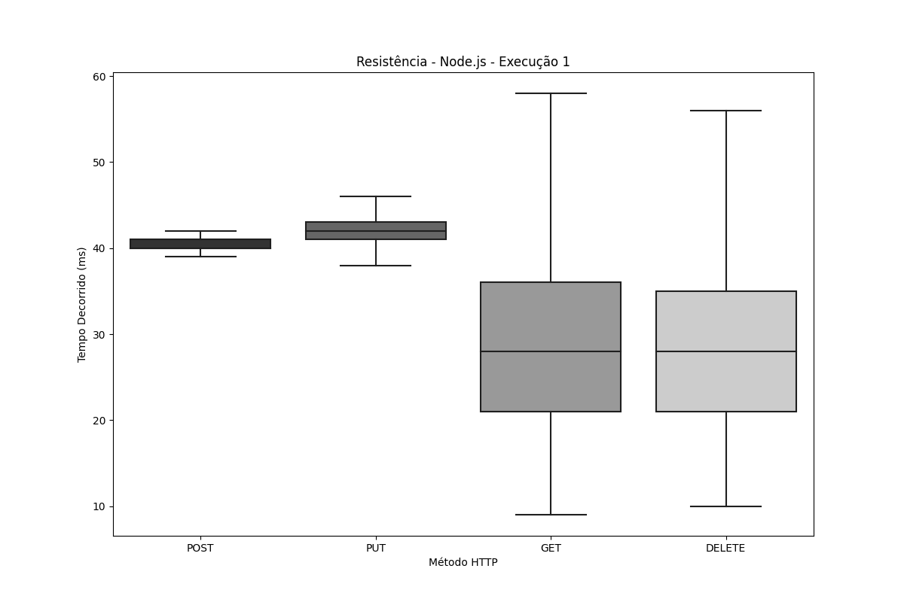
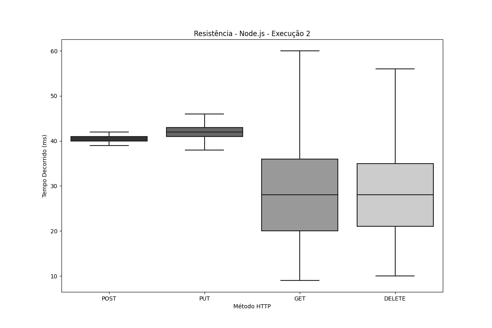
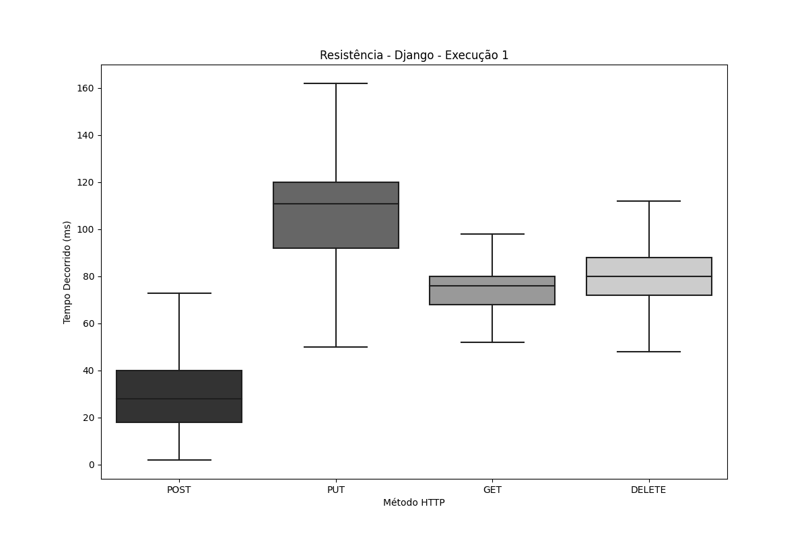
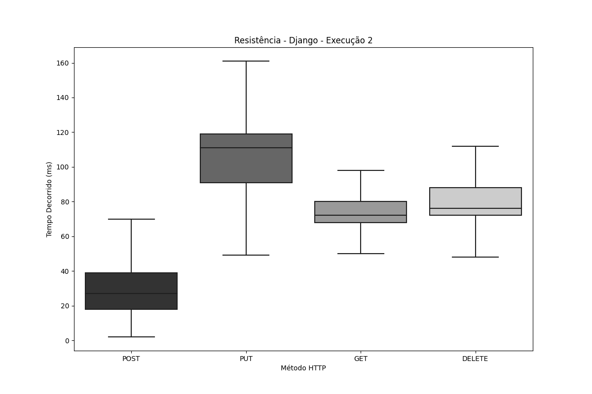
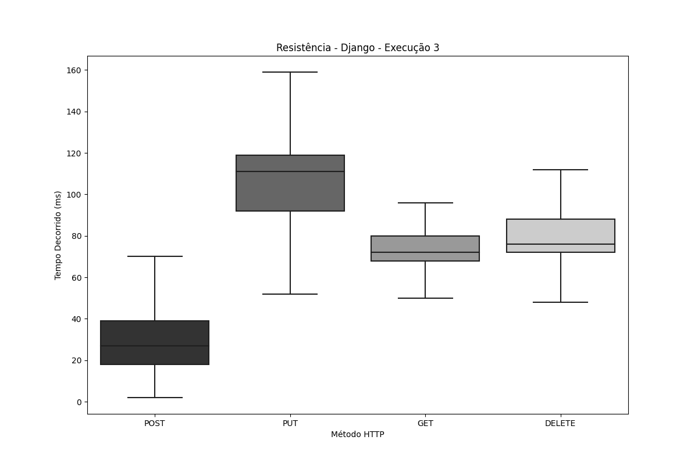
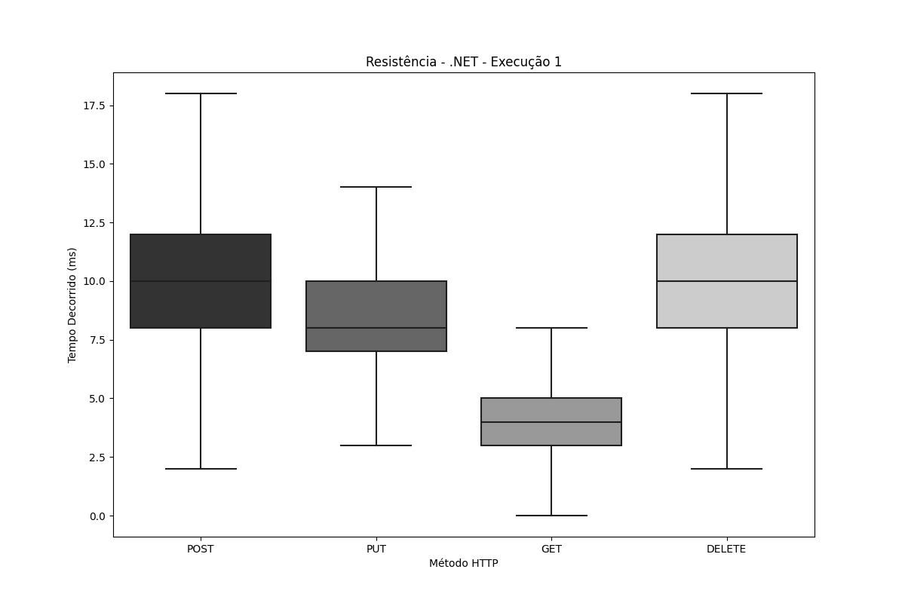
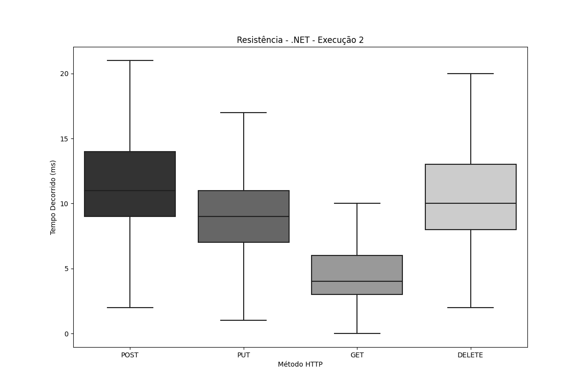

# Teste de Pico

1. [Node.js](#nodejs)
2. [Django](#django)
3. [.NET](#net)

---
# Node.js
## Node.js - Execução 1

| Tipo   | Amostras     | Falhas | Erro % | Average | Min | Max   | Median | 90th pct | 95th pct | 99th pct | Transaction/s | Received | Send  |
|--------|--------------|--------|--------|---------|-----|-------|--------|-----------|-----------|-----------|----------------|----------|-------|
| **Total**  | 14.403.804,0 | 0,00 | 0,00% | 37,5 | 9,0 | 5.317,0 | 41,0 | 108,0 | 208,0 | 515,0 | 1.333,7 | 2.666,5 | 334,8 |
| **DELETE** | 3.600.950,0 | 0,00 | 0,00% | 29,8 | 10,0 | 4.784,0 | 29,0 | 41,0 | 63,0 | 210,0 | 333,4 | 57,3 | 73,2 |
| **GET**    | 3.600.950,0 | 0,00 | 0,00% | 29,7 | 9,0 | 4.694,0 | 29,0 | 42,0 | 60,0 | 219,0 | 333,4 | 2.401,3 | 42,7 |
| **POST**   | 3.600.954,0 | 0,00 | 0,00% | 44,6 | 37,0 | 5.317,0 | 41,0 | 68,0 | 101,0 | 402,0 | 333,4 | 119,7 | 103,2 |
| **PUT**    | 3.600.950,0 | 0,00 | 0,00% | 45,8 | 19,0 | 4.904,0 | 42,0 | 68,0 | 96,0 | 394,0 | 333,4 | 88,2 | 115,7 |

## Node.js - Execução 2

| Tipo   | Amostras     | Falhas | Erro % | Average | Min | Max   | Median | 90th pct | 95th pct | 99th pct | Transaction/s | Received | Send  |
|--------|--------------|--------|--------|---------|-----|-------|--------|-----------|-----------|-----------|----------------|----------|-------|
| **Total**  | 12.696.545,0 | 0,00 | 0,00% | 42,5 | 9,0 | 3.240,0 | 40,0 | 43,0 | 45,0 | 48,0 | 1.175,6 | 2.349,8 | 295,0 |
| **DELETE** | 3.174.100,0 | 0,00 | 0,00% | 33,1 | 10,0 | 2.995,0 | 29,0 | 40,0 | 44,0 | 84,0 | 293,9 | 50,5 | 64,5 |
| **GET**    | 3.174.145,0 | 0,00 | 0,00% | 32,9 | 9,0 | 2.775,0 | 28,0 | 41,0 | 46,0 | 89,0 | 293,9 | 2.116,1 | 37,6 |
| **POST**   | 3.174.150,0 | 0,00 | 0,00% | 51,5 | 37,0 | 3.240,0 | 41,0 | 45,0 | 62,0 | 105,0 | 293,9 | 105,5 | 91,0 |
| **PUT**    | 3.174.150,0 | 0,00 | 0,00% | 52,6 | 22,0 | 2.926,0 | 42,0 | 48,0 | 92,0 | 107,0 | 293,9 | 77,8 | 102,0 |

## Node.js - Execução 3

| Tipo   | Amostras     | Falhas | Erro % | Average | Min | Max   | Median | 90th pct | 95th pct | 99th pct | Transaction/s | Received | Send  |
|--------|--------------|--------|--------|---------|-----|-------|--------|-----------|-----------|-----------|----------------|----------|-------|
| **Total**  | 14.430.497,0 | 0,00 | 0,00% | 37,4 | 9,0 | 1.021,0 | 39,0 | 43,0 | 44,0 | 47,0 | 1.336,2 | 2.671,4 | 335,4 |
| **DELETE** | 3.607.600,0 | 0,00 | 0,00% | 29,6 | 10,0 | 950,0 | 27,0 | 39,0 | 41,0 | 85,0 | 334,1 | 57,4 | 73,3 |
| **GET**    | 3.607.600,0 | 0,00 | 0,00% | 29,4 | 9,0 | 868,0 | 27,0 | 40,0 | 42,0 | 72,0 | 334,1 | 2.405,7 | 42,7 |
| **POST**   | 3.607.650,0 | 0,00 | 0,00% | 44,7 | 36,0 | 1.020,0 | 40,0 | 43,0 | 48,0 | 115,0 | 334,0 | 120,0 | 103,4 |
| **PUT**    | 3.607.647,0 | 0,00 | 0,00% | 45,9 | 19,0 | 1.021,0 | 41,0 | 44,0 | 47,0 | 109,0 | 334,1 | 88,4 | 115,9 |

<h1 align="center">
  
  
  
</h1>

## Node.js - Média das execuções

| Tipo   | Amostras     | Falhas | Erro % | Average | Min | Max   | Median | 90th pct | 95th pct | 99th pct | Transaction/s | Received | Send  |
|--------|--------------|--------|--------|---------|-----|-------|--------|-----------|-----------|-----------|----------------|----------|-------|
| **Total**  | 13.843.615,3 | 0,00 | 0,00% | 39,1 | 9,0 | 3.192,7 | 40,0 | 64,7 | 99,0 | 203,3 | 1.281,8 | 2.562,6 | 321,7 |
| **DELETE** | 3.460.883,3 | 0,00 | 0,00% | 30,8 | 10,0 | 2.909,7 | 28,3 | 40,0 | 49,3 | 126,3 | 320,5 | 55,1 | 70,3 |
| **GET**    | 3.460.898,3 | 0,00 | 0,00% | 30,6 | 9,0 | 2.779,0 | 28,0 | 41,0 | 49,3 | 126,7 | 320,5 | 2.307,7 | 41,0 |
| **POST**   | 3.460.918,0 | 0,00 | 0,00% | 46,9 | 36,7 | 3.192,3 | 40,7 | 52,0 | 70,3 | 207,3 | 320,5 | 115,1 | 99,2 |
| **PUT**    | 3.460.915,7 | 0,00 | 0,00% | 48,1 | 20,0 | 2.950,3 | 41,7 | 53,3 | 78,3 | 203,3 | 320,5 | 84,8 | 111,2 |

---

# Django 
## Django - Execução 1 

| Tipo   | Amostras | Falhas | Erro % | Average | Min | Max | Median | 90th pct | 95th pct | 99th pct | Transaction/s | Received | Send  |
|--------|----------|--------|--------|---------|-----|-----|--------|----------|----------|-----------|----------------|----------|-------|
| **Total**  | 52.691,0 | 84 | 0,16% | 490,8 | 2,0 | 114.212,0 | 96,0 | 938,0 | 1.156,0 | 1.788,9 | 341,8 | 2.456,9 | 85,3 |
| **DELETE** | 12.947,0 | 0 | 0,00% | 275,2 | 43,0 | 2.560,0 | 81,0 | 982,0 | 1.207,0 | 1.528,6 | 117,9 | 35,2 | 25,6 |
| **GET**    | 13.049,0 | 0 | 0,00% | 214,9 | 4,0 | 2.221,0 | 68,0 | 777,0 | 993,0 | 1.278,0 | 118,8 | 3.301,9 | 15,2 |
| **POST**   | 13.457,0 | 84 | 0,62% | 1.163,4 | 2,0 | 114.212,0 | 24,0 | 840,0 | 1.139,0 | 29.362,8 | 87,3 | 39,8 | 26,9 |
| **PUT**    | 13.238,0 | 0 | 0,00% | 289,8 | 28,0 | 2.596,0 | 117,0 | 972,0 | 1.211,0 | 1.611,0 | 120,4 | 55,4 | 41,2 |

## Django - Execução 2

| Tipo   | Amostras | Falhas | Erro % | Average | Min | Max | Median | 90th pct | 95th pct | 99th pct | Transaction/s | Received | Send  |
|--------|----------|--------|--------|---------|-----|-----|--------|----------|----------|-----------|----------------|----------|-------|
| **Total**  | 53.616,0 | 108 | 0,20% | 506,4 | 2,0 | 110.570,0 | 89,0 | 967,0 | 1.209,0 | 1.868,9 | 356,2 | 2.511,8 | 88,8 |
| **DELETE** | 13.179,0 | 0 | 0,00% | 263,5 | 43,0 | 2.259,0 | 85,0 | 913,0 | 1.159,0 | 1.570,4 | 120,0 | 35,9 | 26,0 |
| **GET**    | 13.284,0 | 0 | 0,00% | 189,4 | 4,0 | 2.092,0 | 65,0 | 660,0 | 843,0 | 1.225,2 | 120,9 | 3.292,3 | 15,5 |
| **POST**   | 13.693,0 | 108 | 0,79% | 1.276,6 | 2,0 | 110.570,0 | 30,0 | 891,6 | 1.227,0 | 16.617,0 | 91,0 | 41,8 | 27,9 |
| **PUT**    | 13.460,0 | 0 | 0,00% | 273,7 | 43,0 | 2.717,0 | 113,0 | 917,0 | 1.147,0 | 1.586,0 | 122,4 | 56,3 | 41,9 |

## Django - Execução 3

| Tipo   | Amostras | Falhas | Erro % | Average | Min | Max | Median | 90th pct | 95th pct | 99th pct | Transaction/s | Received | Send  |
|--------|----------|--------|--------|---------|-----|-----|--------|----------|----------|-----------|----------------|----------|-------|
| **Total**  | 53.004,0 | 142 | 0,27% | 566,4 | 2,0 | 111.156,0 | 88,0 | 810,0 | 1.047,0 | 1.607,0 | 350,8 | 2.413,5 | 87,4 |
| **DELETE** | 13.034,0 | 0 | 0,00% | 268,9 | 43,0 | 2.375,0 | 88,0 | 908,0 | 1.096,0 | 1.432,0 | 118,7 | 35,5 | 25,8 |
| **GET**    | 13.133,0 | 0 | 0,00% | 194,6 | 3,0 | 1.964,0 | 72,0 | 654,0 | 826,0 | 1.152,7 | 119,6 | 3.173,3 | 15,3 |
| **POST**   | 13.540,0 | 142 | 1,05% | 1.493,9 | 2,0 | 111.156,0 | 33,0 | 841,0 | 1.119,0 | 111.082,0 | 89,6 | 41,6 | 27,5 |
| **PUT**    | 13.297,0 | 0 | 0,00% | 280,8 | 32,0 | 2.255,0 | 115,0 | 911,0 | 1.101,0 | 1.439,0 | 121,0 | 55,7 | 41,4 |

<h1 align="center">
  
  
  
</h1>

## Django - Média das execuções

| Tipo   | Amostras | Falhas | Erro % | Average | Min  | Max   | Median | 90th pct | 95th pct | 99th pct | Transaction/s | Received | Send  |
|--------|----------|--------|--------|---------|------|-------|--------|-----------|-----------|-----------|----------------|----------|-------|
| **Total**  | 53.103,7 | 111,33 | 0,21% | 521,2 | 2,0  | 111.979,3 | 91,0 | 905,0 | 1.137,3 | 1.754,9 | 349,6 | 2.460,8 | 87,2 |
| **DELETE** | 13.053,3 | 0,00 | 0,00% | 269,2 | 43,0 | 2.398,0 | 84,7 | 934,3 | 1.154,0 | 1.510,3 | 118,9 | 35,5 | 25,8 |
| **GET**    | 13.155,3 | 0,00 | 0,00% | 199,6 | 3,7  | 2.092,3 | 68,3 | 697,0 | 887,3 | 1.218,6 | 119,8 | 3.255,8 | 15,3 |
| **POST**   | 13.563,3 | 111,33 | 0,82% | 1.311,3 | 2,0  | 111.979,3 | 29,0 | 857,5 | 1.161,7 | 52.353,9 | 89,3 | 41,0 | 27,4 |
| **PUT**    | 13.331,7 | 0,00 | 0,00% | 281,4 | 34,3 | 2.522,7 | 115,0 | 933,3 | 1.153,0 | 1.545,3 | 121,3 | 55,8 | 41,5 |

---

# .NET 
## .NET - Execução 1

| Tipo   | Amostras     | Falhas | Erro % | Average | Min | Max   | Median | 90th pct | 95th pct | 99th pct | Transaction/s | Received | Send  |
|--------|--------------|--------|--------|---------|-----|-------|--------|-----------|-----------|-----------|----------------|----------|-------|
| **Total**  | 7.119.831,0 | 0,00 | 0,00% | 75,8 | 2,0 | 3.262,0 | 76,0 | 116,0 | 123,0 | 158,0 | 659,2 | 1.112,2 | 165,3 |
| **DELETE** | 1.779.932,0 | 0,00 | 0,00% | 82,7 | 44,0 | 888,0 | 76,0 | 104,0 | 116,0 | 132,0 | 164,8 | 49,3 | 36,1 |
| **GET**    | 1.779.940,0 | 0,00 | 0,00% | 77,9 | 2,0 | 272,0 | 76,0 | 112,0 | 116,0 | 120,0 | 164,8 | 913,3 | 21,1 |
| **POST**   | 1.779.980,0 | 0,00 | 0,00% | 33,8 | 2,0 | 3.262,0 | 23,0 | 49,0 | 60,0 | 90,0 | 164,8 | 73,5 | 51,0 |
| **PUT**    | 1.779.979,0 | 0,00 | 0,00% | 109,0 | 43,0 | 934,0 | 115,0 | 147,0 | 157,0 | 165,0 | 164,8 | 76,2 | 57,1 |

## .NET - Execução 2

| Tipo   | Amostras     | Falhas | Erro % | Average | Min | Max   | Median | 90th pct | 95th pct | 99th pct | Transaction/s | Received | Send  |
|--------|--------------|--------|--------|---------|-----|-------|--------|-----------|-----------|-----------|----------------|----------|-------|
| **Total**  | 7.157.157,0 | 0,00 | 0,00% | 75,4 | 2,0 | 4.352,0 | 72,0 | 120,0 | 125,0 | 161,0 | 662,7 | 1.115,9 | 166,2 |
| **DELETE** | 1.789.265,0 | 0,00 | 0,00% | 82,3 | 44,0 | 4.352,0 | 76,0 | 108,0 | 116,0 | 128,0 | 165,7 | 49,5 | 36,3 |
| **GET**    | 1.789.281,0 | 0,00 | 0,00% | 77,2 | 4,0 | 924,0 | 72,0 | 104,0 | 112,0 | 120,0 | 165,7 | 916,0 | 21,2 |
| **POST**   | 1.789.308,0 | 0,00 | 0,00% | 33,7 | 2,0 | 4.209,0 | 20,0 | 46,0 | 57,0 | 82,0 | 165,7 | 73,8 | 51,3 |
| **PUT**    | 1.789.303,0 | 0,00 | 0,00% | 108,5 | 43,0 | 4.070,0 | 116,0 | 152,0 | 159,0 | 166,0 | 165,7 | 76,6 | 57,4 |

## .NET - Execução 3

| Tipo   | Amostras     | Falhas | Erro % | Average | Min | Max   | Median | 90th pct | 95th pct | 99th pct | Transaction/s | Received | Send  |
|--------|--------------|--------|--------|---------|-----|-------|--------|-----------|-----------|-----------|----------------|----------|-------|
| **Total**  | 7.152.054,0 | 0,00 | 0,00% | 75,5 | 2,0 | 7.268,0 | 76,0 | 113,0 | 120,0 | 152,0 | 662,2 | 1.114,6 | 166,1 |
| **DELETE** | 1.787.994,0 | 0,00 | 0,00% | 82,3 | 44,0 | 520,0 | 80,0 | 108,0 | 116,0 | 136,0 | 165,6 | 49,5 | 36,3 |
| **GET**    | 1.788.006,0 | 0,00 | 0,00% | 77,3 | 2,0 | 404,0 | 72,0 | 96,0 | 108,0 | 120,0 | 165,6 | 914,8 | 21,2 |
| **POST**   | 1.788.028,0 | 0,00 | 0,00% | 33,4 | 2,0 | 7.268,0 | 35,0 | 57,0 | 67,0 | 87,0 | 165,6 | 73,8 | 51,3 |
| **PUT**    | 1.788.026,0 | 0,00 | 0,00% | 108,9 | 43,0 | 542,0 | 96,0 | 123,0 | 133,0 | 161,0 | 165,6 | 76,5 | 57,4 |

<h1 align="center">
  
  
  
</h1>

## .NET - Média das execuções

| Tipo   | Amostras     | Falhas | Erro % | Average | Min | Max   | Median | 90th pct | 95th pct | 99th pct | Transaction/s | Received | Send  |
|--------|--------------|--------|--------|---------|-----|-------|--------|-----------|-----------|-----------|----------------|----------|-------|
| **Total**  | 7.143.014,0 | 0,00 | 0,00% | 75,6 | 2,0 | 4.960,7 | 74,7 | 116,3 | 122,7 | 157,0 | 661,4 | 1.114,2 | 165,9 |
| **DELETE** | 1.785.730,3 | 0,00 | 0,00% | 82,5 | 44,0 | 1.920,0 | 77,3 | 106,7 | 116,0 | 132,0 | 165,4 | 49,4 | 36,2 |
| **GET**    | 1.785.742,3 | 0,00 | 0,00% | 77,5 | 2,7 | 533,3 | 73,3 | 104,0 | 112,0 | 120,0 | 165,4 | 914,7 | 21,2 |
| **POST**   | 1.785.772,0 | 0,00 | 0,00% | 33,6 | 2,0 | 4.913,0 | 26,0 | 50,7 | 61,3 | 86,3 | 165,4 | 73,7 | 51,2 |
| **PUT**    | 1.785.769,3 | 0,00 | 0,00% | 108,8 | 43,0 | 1.848,7 | 109,0 | 140,7 | 149,7 | 164,0 | 165,4 | 76,4 | 57,3 |
